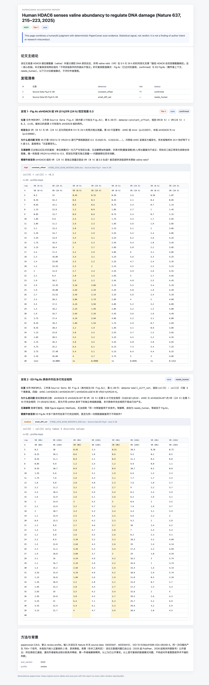

# 论文柯南 / paperconan

> **真相只有一个！**
>
> 现在学术界弊病丛生，
> 大家要小心 paperconan 的推理哦！
> 唯一看透论文数据真相的，
> 是这个外表看似 Python 小工具、
> 智慧却过于常人的——
>
> 名侦探，**论文柯南**！

---

## 它是什么

`paperconan` 是一个 **论文源数据 sanity check** 工具。你给它一个目录（`.xlsx` / 旧版 `.xls` / `.xlsm` / `.csv` / `.tsv`，也可以混放补充材料 `.pdf` / `.docx` 里的结构化表格，以及经 `--images` 明确启用的本地图像），它运行数值检测器、登记图像资产，并把"值得人工复核的位置"交给外部 Agent 统一判断。

**它输出的是 statistical signal，不是作者意图判断。** 最终判断仍要看原表、figure legend、Methods、作者回应和期刊/机构核实。

它最常见、也最被推荐的用法，是 **让 AI agent（Claude Code / Codex 等）搭配本仓库的 skill 来跑**：你用自然语言提需求，agent 调真实的 Python 检测器、解析结果、按规则解读，而不是肉眼猜数字。下面就以这个场景为主线。纯 CLI / Python 库用法见 [命令行与库参考](docs/cli.md)。

**适合谁：**

- 研究生 / 青椒：引用论文前先 sanity check 一遍
- 实验室 / 课题组 / 院系：做公开 source data 初筛
- PubPeer 准备：先定位具体表格、行列和规则，再决定怎么提问
- 批量审计：扫一个期刊 / 一个作者组 / 一批 DOI，再用 agent 分级

**不做什么：**

- 不判断作者意图或责任，也不替代统计学审稿
- 不自主判断 Western blot、显微镜图、凝胶图或图像拼接；图像语义复核由能读取本地图片的外部多模态 Agent 完成
- 不从柱状图 / 折线图像素里数字化数据点
- 不配置模型 API、密钥或 provider SDK；确定性 `image_findings` 只是可选提示，不是完整复核清单
- 不绕付费墙，也不把"没找到公开数据"当成"论文干净"

---

## 先看一眼：一份真实的判定后报告

下面这份报告来自一个**已经公开、机构也已处理**的案例——Nature 论文 *Human HDAC6 senses valine abundancy to regulate DNA damage*（Nature 637, 215–223, 2025；DOI [10.1038/s41586-024-08248-5](https://doi.org/10.1038/s41586-024-08248-5)）。该文的 source data 问题自 2025 年起在 [PubPeer](https://pubpeer.com/search?q=10.1038%2Fs41586-024-08248-5) 被公开提出，2026 年经科普账号进一步传播；随后所在高校通报，通讯作者被免去院长职务并降级、第一作者被解除聘用。

我们只做一件可复现的事：把这篇论文的 Nature 公开 source data 交给 `paperconan` 跑一遍，再让 AI agent 按 skill 的[判定协议](#2-把-skill-接到你的-agent-上)写出 `verdict.json`，最后用 `paperconan report` 渲染成这份报告。



paperconan 的 `constant_offset` 检测器**独立地**指出：`Source Data Fig.4`（表内标注 `Fig.4c`）里 **shHDAC6** 组标为 **VR (0 h)** 与 **VR (24 h)** 的两列（本应是同批样本 0 h 与 24 h 的独立测量），在整整 35 行里**逐行严格相差固定的 0.3**（0.45/0.15、0.60/0.30、3.34/3.04……）。这正是公众此前指出的 Figure 4c 异常点——工具没有"看图猜"，它是从原始 source data 里把这条数字规律精确定位到了「哪个文件、哪张表、哪几行、哪条规则」。

这份判定还经过了一轮**红队对抗复核**（默认假设它是误报去反驳，10 类良性机制逐一排除）才标为 `confirmed`。同一次扫描其实抛出了 700+ 个信号，报告只把**扛得住反向质疑的那一条**纳入判定、其余降级——这份克制正是 signal-not-verdict 的落地。

> **守住红线**：paperconan 输出的是**可复核的数值模式**，不是作者意图结论。上面的机构处理是**已公开事实**，不是 paperconan 的判定。工具只负责把任何人都能复现的信号定位清楚；后续判断仍要靠原始数据、作者回应和机构/期刊核实。
>
> 复现这份报告的完整命令见 [报告与调参 › 判定后 HTML 报告](docs/reports.md#判定后-html-报告)。

---

## 快速开始（推荐：Agent + Skill）

### 1. 装好 CLI（skill 在背后调它）

需要 Python >= 3.10。

```bash
pip install "paperconan[all]"   # [all] 含 PDF / Word 表格抽取，建议直接装
pip install "paperconan[image]" # 只增加图像资产、PDF 页面与可选图像提示
paperconan --version            # 确认可用
```

> 基础版已内置 Rust 读取引擎（`python-calamine`），旧版 `.xls` / `.xlsm` / `.xlsb` 开箱即读、`.xlsx` 也更快；其它安装变体见 [命令行与库参考 › 安装](docs/cli.md#安装)。
>
> 有 shell + Python 环境的 agent（如本地 Claude Code / Codex），装好 skill 后会在首次扫描前自动检测并 `pip install` 这个 CLI，你也可以跳过这一步直接进入第 2 步。

### 2. 把 skill 接到你的 agent 上

最简单的方式：用跨 agent 安装器 [`npx skills`](https://github.com/vercel-labs/skills)，一条命令搞定 Claude Code / Codex / Cursor 等：

```bash
npx skills add zixixr/paperconan                          # 自动装到检测到的 agent

# 也可以指定 agent 或安装范围：
npx skills add zixixr/paperconan -a claude-code -a codex  # 只装这两个
npx skills add zixixr/paperconan -g                       # 装到全局（用户级）
```

它会克隆 repo、发现其中的 `paperconan` skill，并按各 agent 自己的目录约定接好 —— 你不用关心 `~/.claude/skills`、Codex 等各家路径差异。

**手动方式（fallback）：** 不想用 npx、或想让 skill 跟着 `git pull` 一起更新，可以软链 Claude Code 的个人 skill 目录：

```bash
git clone https://github.com/zixixr/paperconan.git
mkdir -p ~/.claude/skills
ln -s "$(pwd)/paperconan/skills/paperconan" ~/.claude/skills/paperconan
```

如果你的 agent 还不支持 skill 目录发现，可以退而求其次在项目指令里引用 `SKILL.md`：

```bash
echo '@'"$(pwd)"'/paperconan/skills/paperconan/SKILL.md' >> AGENTS.md
```

安装或更新 skill 后，重启 agent 会话，让它重新发现 skill。

[`skills/paperconan/SKILL.md`](skills/paperconan/SKILL.md) 是 agent 的入口，它强制 agent 跑真实检测器、按 `references/` 里的规则解读，并守住 **signal-not-verdict** 红线。

skill 里还包含公开可复用的判定协议：[`adjudication-tiers.md`](skills/paperconan/references/adjudication-tiers.md) 定义 Tier 1/2/3、`KEEP` / `DROP` / `NEEDS_HUMAN`，[`report-templates.md`](skills/paperconan/references/report-templates.md) 定义短报告和正式 8 节报告，[`adversarial-review.md`](skills/paperconan/references/adversarial-review.md) 定义红队复核流程。这里的 Tier 只表示复核优先级和无辜解释难度，**不是作者意图判断**。

### 3. 直接用自然语言提需求

接好后你不用记任何命令，直接说话即可，例如：

- "帮我查一下这篇论文的源数据有没有问题：`10.1038/sxxxxx`"
- "扫一下 `~/Downloads/source_data/` 这个目录，挑出最该人工复核的几条"
- "这条 cross-sheet 命中是不是误报？帮我对照原表看一下"

agent 会自己判断该 `fetch` 还是直接 `scan`、解析 `scan.json`、加载对应 reference、必要时打开原表，再给你一份带证据、带良性解释、带"还需要什么人工背景"的回答。

图像复核走同一条流程。Agent 先确认自己能否打开本地图像，再逐项读取
`image_assets`：先看整图，再对小面板或未解决细节使用原始像素裁剪。
`image_findings` 仅用于提示，不能代替完整资产覆盖；每项资产必须落入
reviewed、unresolved、unreadable 或 deferred 中的一项。数值与图像判断写进同一个
`verdict.json findings[]`，最后只生成一份判定后报告。

对应的完整命令是：

```bash
paperconan fetch "<DOI or title>" --auto --images --out data/
paperconan data/ --images
paperconan data/ --images --image-diagnostics
paperconan report data/audit/scan.json --verdict verdict.json --out adjudication.html
```

如果 Agent 没有本地图像能力，它应把 `image_review.status` 写为
`unavailable_no_multimodal`，明确说明图像语义复核未完成，并继续数值复核。
PaperConan 本身不调用或配置模型服务。

> 没有可用 Python 环境的 agent，应当请你本地跑命令，**绝不能把肉眼猜测冒充成 paperconan 输出**。

---

## 报告怎么读（要点）

`paperconan <dir>` 直接生成的 `audit/report.html` 是**确定性检测器的原始信号 / 人工复核工作台**——按设计就含**大量 false positive**（共享对照、重绘坐标轴、单位换算、派生列……多数命中都有良性解释），**不代表任何结论**，不适合当成品直接对外。

**要拿到一份正规、经过判断的报告，请搭配 Agent + skill 使用**：检测器只产出可复现的原始信号和可选图像提示，由 Agent 对照原表、整图、原始像素裁剪、图注与 Methods 逐条判定后，再把数值与图像 finding 一起生成[判定后报告](docs/reports.md#判定后-html-报告)。纯 CLI 不会自主完成语义判断。

怎么读这份原始信号、`--profile` 误报控制、判定后报告的生成，详见 **[报告与调参](docs/reports.md)**。

---

## ⚠️ 重要声明

`paperconan` 输出的是 **算法标注的可疑模式**，不是学术不端结论。最终判定需由原作者澄清、期刊编辑部核实，或经独立同行复议。

**请走正规渠道：** 把可疑 signal 提交 PubPeer / 联系期刊 ethics inquiry / 涉及本单位走 research integrity office。

**请不要：** 在社交媒体直接指控具体作者 / 把 paperconan 截图当"实锤" / 跳过作者澄清直接定性。

工具是中立的，使用方式不能。

---

## 文档

主干在本页；细节在 [`docs/`](docs/)：

- [它能找出什么](docs/detectors.md) —— 全部检测器概览表
- [报告与调参](docs/reports.md) —— 报告怎么读、`--profile` 误报控制、判定后 HTML 报告
- [批量扫描推荐工作流](docs/batch-workflow.md) —— fetch → scan → filter → 立卷 → agent 判定 → 分级 → 对抗
- [命令行与库参考](docs/cli.md) —— 安装、扫描、fetch、PDF/Word、Python 库、内存/输出保护
- [FAQ](docs/faq.md)

面向 **AI agent / skill** 的深入规则见 [`skills/paperconan/references/`](skills/paperconan/references/)：
[detectors](skills/paperconan/references/detectors.md) ·
[output-schema](skills/paperconan/references/output-schema.md) ·
[judgment-rubric](skills/paperconan/references/judgment-rubric.md) ·
[interpretation](skills/paperconan/references/interpretation.md) ·
[adjudication-tiers](skills/paperconan/references/adjudication-tiers.md) ·
[report-templates](skills/paperconan/references/report-templates.md) ·
[adversarial-review](skills/paperconan/references/adversarial-review.md) ·
[batch-workflow](skills/paperconan/references/batch-workflow.md) ·
[case-patterns](skills/paperconan/references/case-patterns.md)

---

## 示例

[`examples/`](examples/) 有完整合成 demo：两份伪造 source data、已生成的 `audit/scan.json` + `report.html`、截图和逐条解读。先看 [examples/README.md](examples/README.md) 和 [examples/report-preview.png](examples/report-preview.png)，或自己跑：

```bash
cd examples
paperconan demo_paper
open demo_paper/audit/report.html
```

---

## 路线图

已完成：`.xlsx` / 旧版 `.xls` / `.xlsm` / `.csv` / `.tsv` 输入 · HTML 报告与 evidence 高亮 · PDF / Word 表格输入 · `paperconan fetch` 开放源检索下载 · Agent skill bundle · Columnar engine（calamine 快速读取，含旧版 Excel）+ 内存/输出保护 · `review` / `forensic` / `triage` profiles 与确定性 prefilter · 跨 sheet / 跨文件整列复用 + 矩阵小数位复用 + 连续段偏移 + 整数差共享小数 + 固定行向量跨图复发等重复/变换检测器 · 合法本地图像资产登记、可选非门控图像提示、外部多模态 Agent 覆盖记账，以及数值与图像 finding 的统一判定报告。

未完成：跨论文扫描（一个 lab / 作者组多篇一起看复用）· 图表像素数字化 · 更全面的确定性图像模式提示 · 与 PubPeer Public API 联动。

欢迎 PR —— 加检测器模式、补文档、做 demo 都欢迎。

---

## 诞生背景

这个工具最早是为做一期 YouTube / 抖音 / B 站视频造的：用公开 source data 扫 Nature 及子刊论文，定位可疑数值模式。开源给所有人，希望它能帮认真做实验的人减少被编造数据挤占空间的概率。

## License

MIT.

## Acknowledgments

- 名侦探柯南 / Detective Conan © 青山刚昌 / TMS Entertainment。借了一下片头叙事结构。
- PubPeer。paperconan 的输出最终应该服务于具体、克制、可复核的公开质疑。
